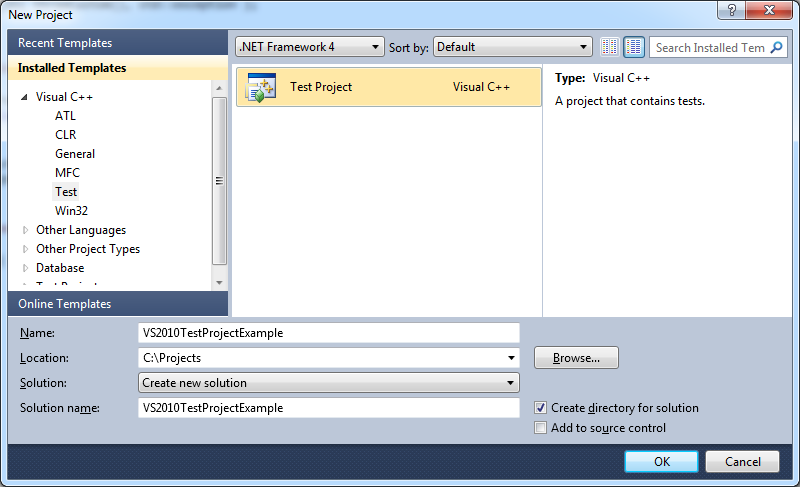
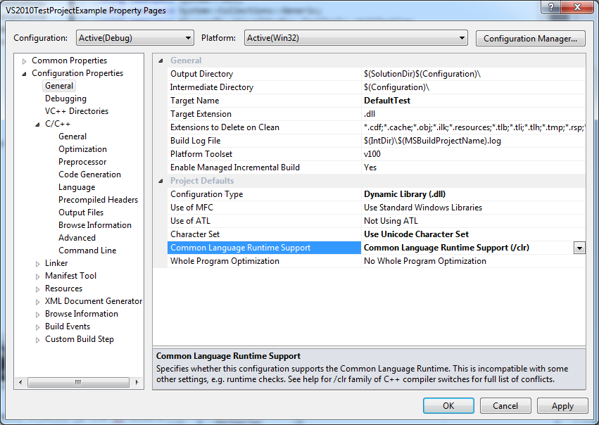
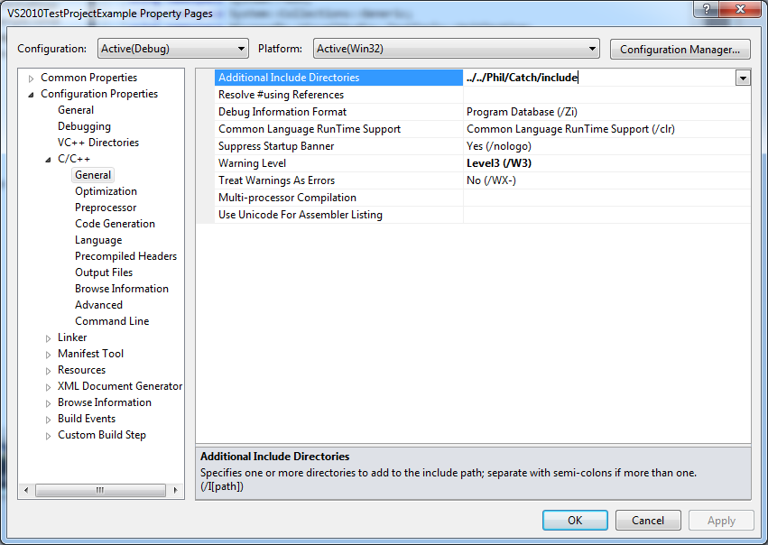
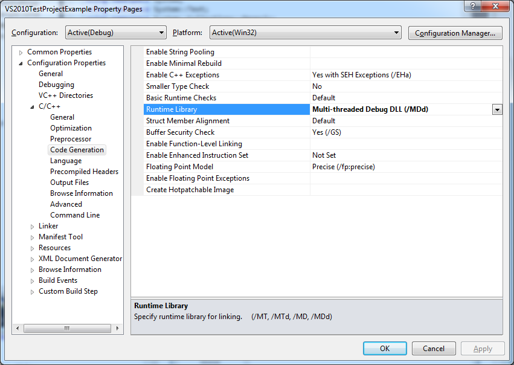
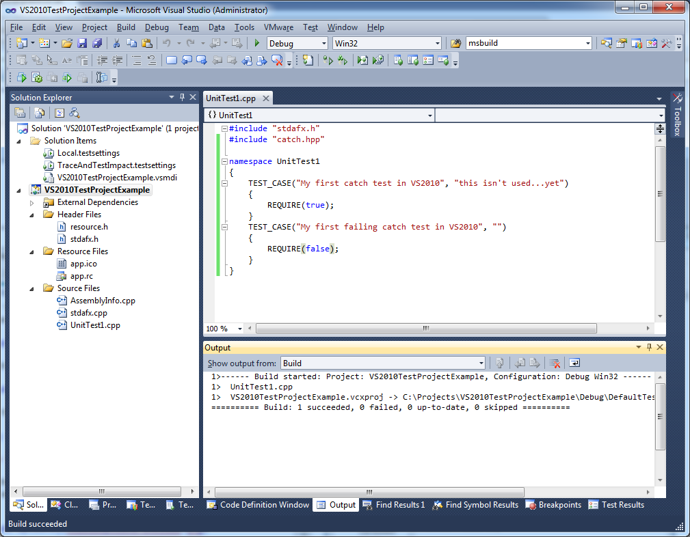
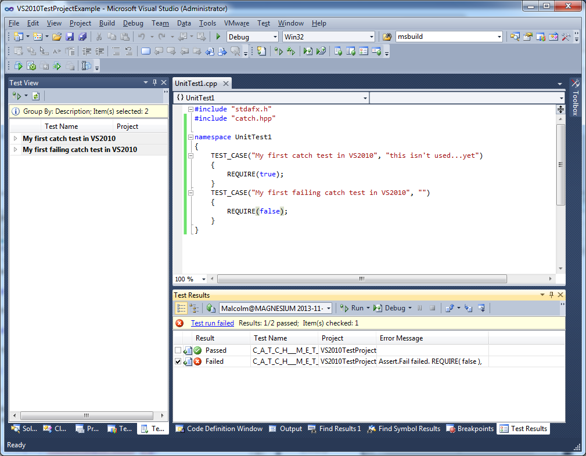
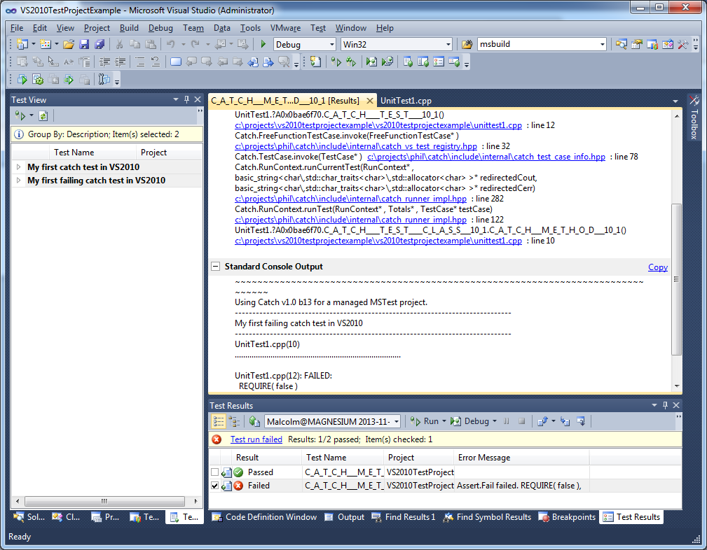
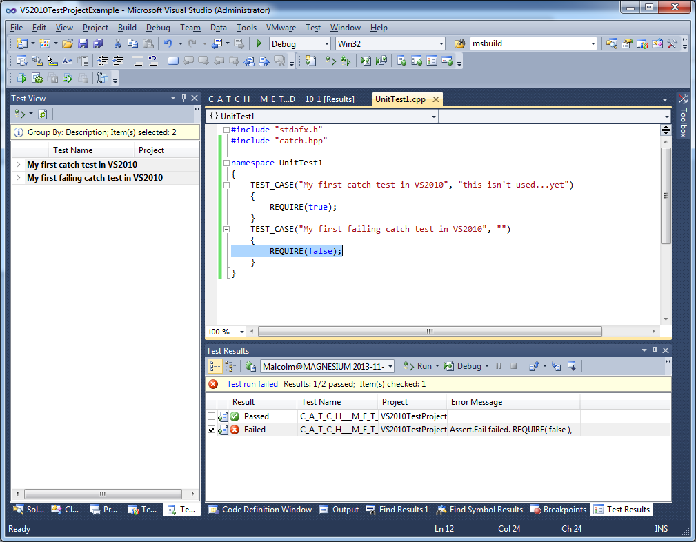

Creating managed tests in VS2010 is pretty easy, but requires a small amount of extra work to be able to use Catch.

[pre-requisite - obviously, you'll also need Catch - my copy is in C:\Projects\Phil\Catch in the following examples...and I'm using the normal, multiple include files.]

## First, start by creating a new project

Choose 'File' ==> 'New' ==> 'Project' and select a new Visual C++ Test project:


Now we need to change some build options, so right click the project and choose 'Properties':

First, in the 'General' options, change 'Common Language Runtime Support' to use basic clr:



By default, Unicode will have been enabled - it is up to you whether to use Unicode or not - Catch will work with either setting.

Next, add Catch to the 'includes':



...and change the debug runtime to be a Debug DLL:



## Now write a test

Next, delete the test code that the wizard provided in UnitTest1.cpp and write your own...




We can run this from the 'Test View' but be sure to select the option to 'Group By' Description if you want to see the Catch TEST_CASE names:




From here, double clicking on the failure takes you to the failure description as normal, where you get links to the code and the output of what happened...



Now if you click the link for (in this case) "...unittest1.cpp: line 12" you get back to the problem:



And that's it!

## Running tests from the command line

Tests can also be run from the command line.  [For VS2010 see these details](VS2010commandline.md)

## Creating a Catch console project

If you want to run Catch normally from the console, just create a new Windows Console app (you will need to turn off Unicode for this!) and add an additional .cpp file for `'main()'`.  I usually add a file called main.cpp, like this:

```
#define CATCH_CONFIG_MAIN
#include "catch.hpp"
``` 

---

[Home](../../README.md)