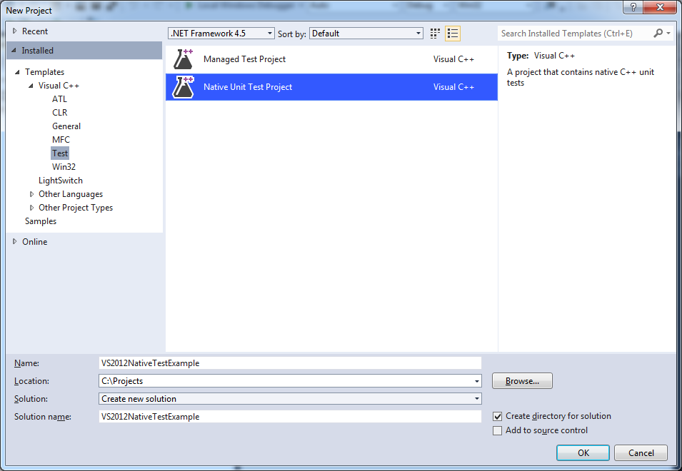
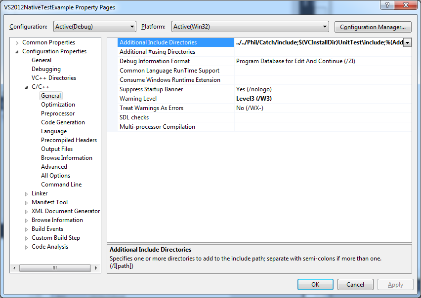
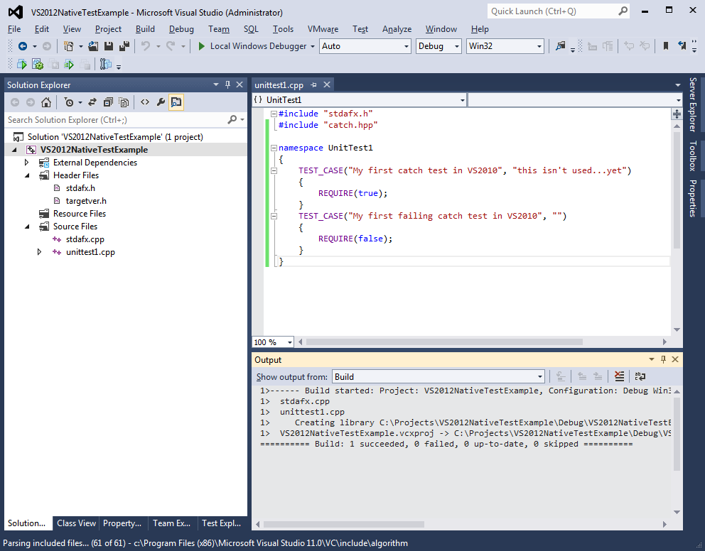
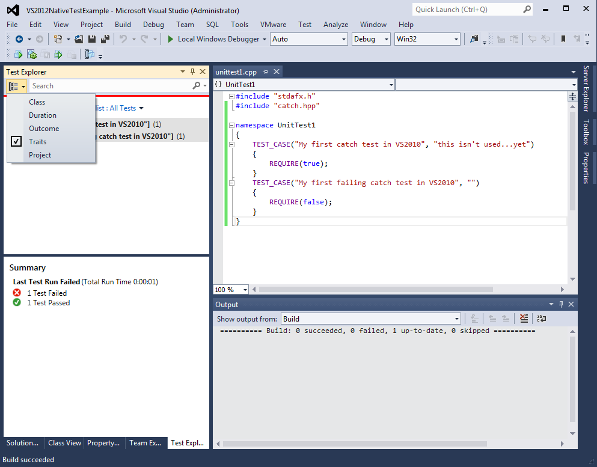
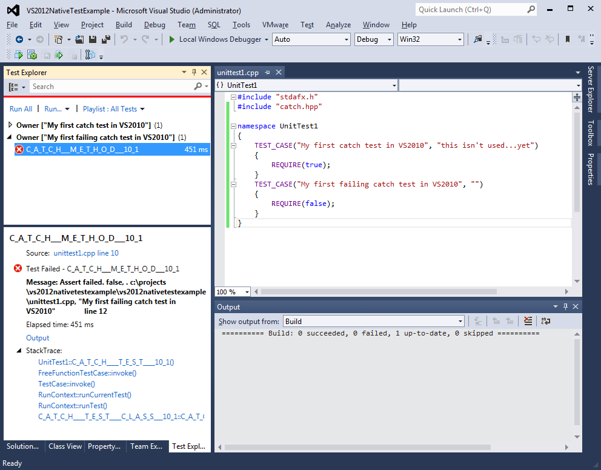
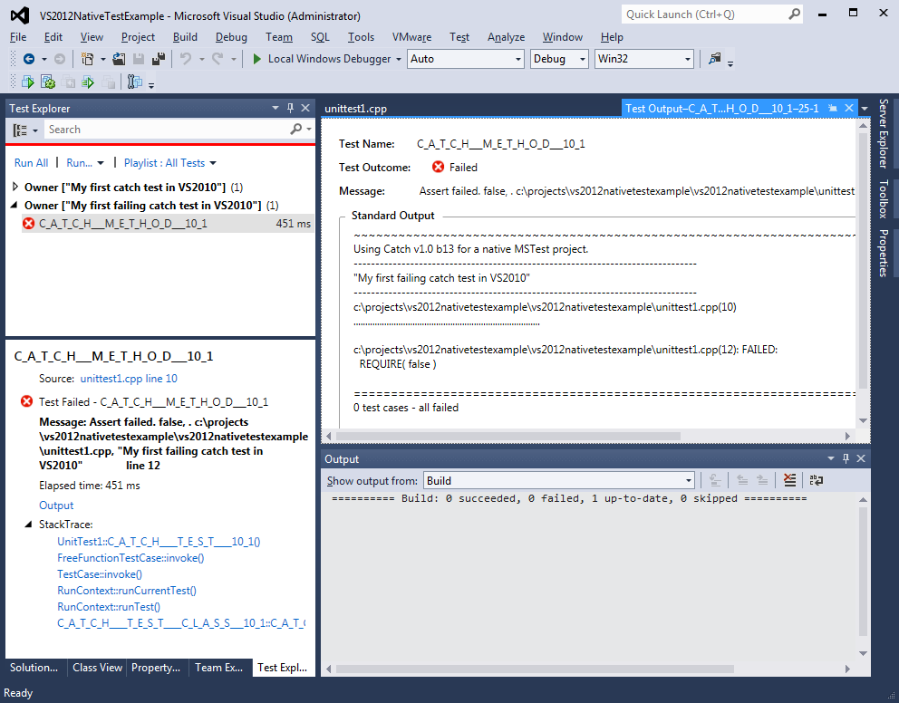
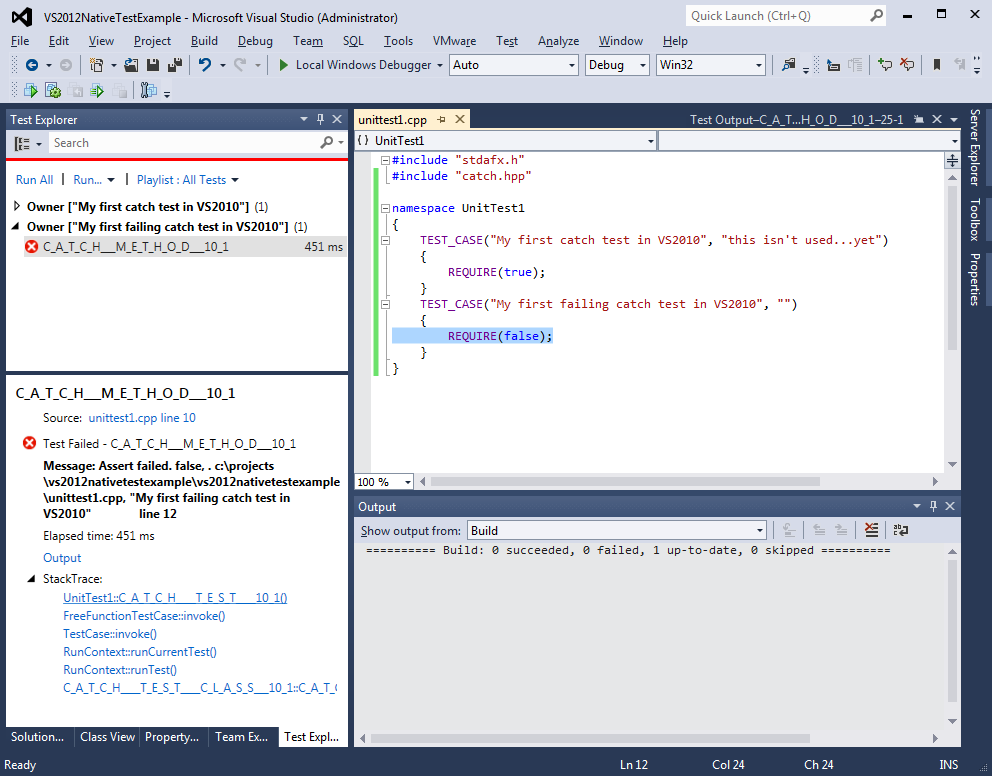

Creating managed tests in VS2012 is very similar to creating managed tests.

[pre-requisite - obviously, you'll also need Catch - my copy is in C:\Projects\Phil\Catch in the following examples...and I'm using the normal, multiple include files.]

## First, start by creating a new project

Choose 'File' ==> 'New' ==> 'Project' and choose a new Visual C++ Native Test project:


Now we need to change some build options, so right click the project and choose 'Properties':

There's no CLR option this time of course, but by default, Unicode will have been enabled - it is up to you whether to use Unicode or not - Catch will work with either setting.

Next, add Catch to the 'includes':



...and the wizard has correctly selected the debug runtime DLL.

## Now write a test

[Note that to avoid name clashes it is best to put your tests in a namespace for those tests, as described here!](vs-index.md)

Next, delete the test code that the wizard provided in UnitTest1.cpp and write your own...




We can run this from the 'Test Explorer' but be sure to select the 'Traits' option from the drop down if you want to see the Catch TEST_CASE names:




Sadly, VS2012 is not as intuitive as VS2010; from here you have top open up the failing test to get the failure information:



You can click the 'Output' link to see the output text:



Now if you click the link at the top of the stack trace "...unittest1.cpp: line 12" you get back to the problem:



And that's it!

## Running tests from the command line

Tests can also be run from the command line.  [For VS2012 see these details](VS2012commandline.md)

## Creating a Catch console project

If you want to run Catch normally from the console, just create a new Windows Console app (you will need to turn off Unicode for this!) and add an additional .cpp file for `'main()'`.  I usually add a file called main.cpp, like this:

```
#define CATCH_CONFIG_MAIN
#include "catch.hpp"
``` 

---

[Home](../../README.md)