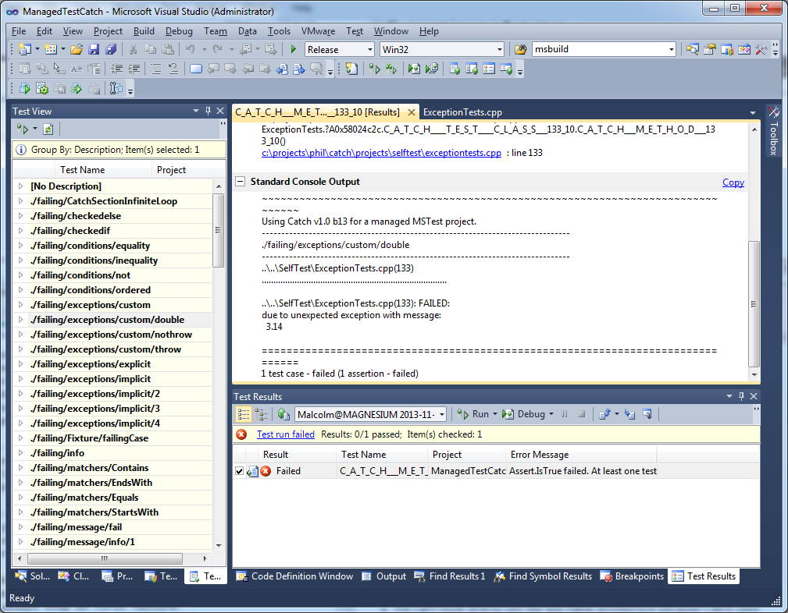
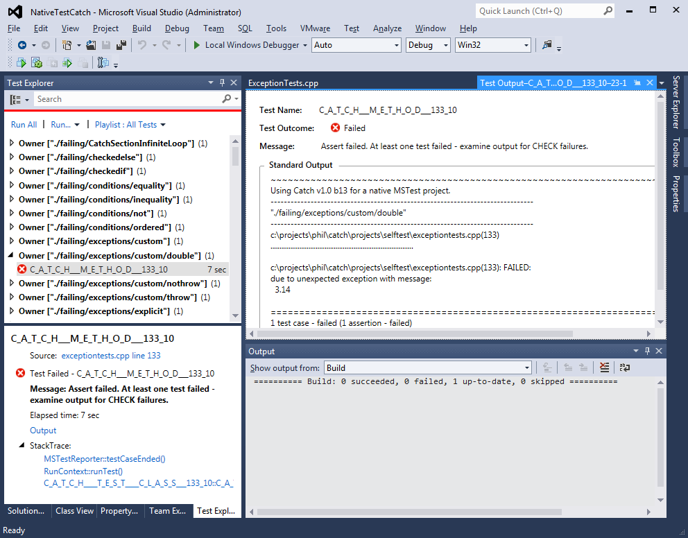

Catch now supports integration with Visual Studio 2010 and 2012. It does this by redefining the macros to use existing VS features; whilst this isn't perfect, it seems to be a workable solution for those people who want to use the VS IDE, or for those who need to provide integration with CI systems that are able to process the test results generated by using MSBuild/vstest.console.exe.

What does this mean? It means that (with a little care) you can use the same source code for regular Catch, Managed Catch projects in VS and Native Catch projects in VS2012, and you can run tests, see the results and 'click to go to the error' when a test fails.

## VS2010 - Managed tests

In VS2010 we can use the managed C++ tests created by the VS wizard - [see this page for instructions on how to do this](VS2010instructions.md)....

...and you'll end up with something like this:


(Note: the test is meant to fail!)

## VS2012 - Managed and Native tests

We can do the same for VS2012 - [see this page for instructions on how to do this for managed tests](VS2012managed-instructions.md) and [this page for native tests](VS2012native-instructions.md)....

...and you'll end up with something like this:


# Running tests from the command line

Tests can also be run from the command line.  [For VS2010 see these details](VS2010commandline.md) and [for VS2012 see these](VS2012commandline.md).

# Running tests using Catch tags

If you've used the Catch command line, you'll know that Catch can selectively include and exclude tests using tags.  For example, you might want to exclude long running tests from each check-in to your CI server, so you might tag those tests with `[slow]` and run Catch with `example.exe ~[slow]`.

It doesn't look like it's possible to reproduce the flexibility of Catch but it is possible to do some basic filtering using Catch tags.

[This page details how to do this.](VScommandlinetags.md)
 
# Differences in behaviour 

There are some minor differences in behaviour between Catch and Visual Studio projects; some are inevitable consequences of the 'run one test at a time' architecture of VS, whilst others are workarounds for 'features' in VS itself:

* We can't hook directly into the test name architecture because Catch uses free form text for TEST_CASE names.
* Catch tests always stop on first failure.
* Tests in different modules may have name clashes.

## TEST_CASE names

You can still use the same names that you would normally use for Catch TEST_CASE names, however we use an internal name for the actual function name that the test lives in.  This means that you won't see the Catch names in the Test View (VS2010) unless you 'Group By' Description, or in VS2012 you select the 'Traits' view Test Explorer - see the screen shots above.
 
## When running from the GUI, Catch tests always stop on first failure.

A Catch test that uses SECTIONS will continue to run further sections if one fails; in VS this doesn't make much sense because in a visual environment we want to capture the context of where the test failed.  If we allowed the test to continue then we lose this context, so instead we always stop on each failure.  You can still use the CHECK macros if you don't want the test to stop.

## Tests in different modules may have name clashes.

In Native tests in VS2012, we have to create a Catch test case with a name that may clash with one in another module (.cpp file). If you put all your tests in a namespace that corresponds to the name of the file (e.g. ClassTest.cpp has tests in namespace ClassTests) then this never happens because the internal name that we assign is unique.  It would have been nice to have used an anonymous namespace but sadly if we do this then all the tests disappear from TestExplorer!  So we're stuck with the clashes; if you get a linker error like this:

```
1>VariadicMacrosTests.obj : error LNK2005: "void __cdecl
 if_you_get_this_error_you_have_a_test_case_name_clash_please_put_a_namespace_around_the_test_case_at_line_23(void)"
 (?if_you_get_this_error_you_have_a_test_case_name_clash_please_put_a_namespace_around_the_test_case_at_line_23@@YAXXZ)
 already defined in MessageInstantiationTests2.obj
```
then you need to add/rename a namespace to avoid the clash.  

---

[Home](../../README.md)